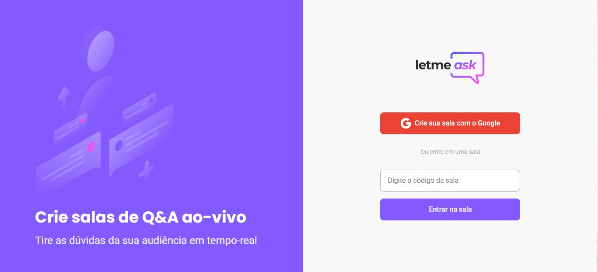
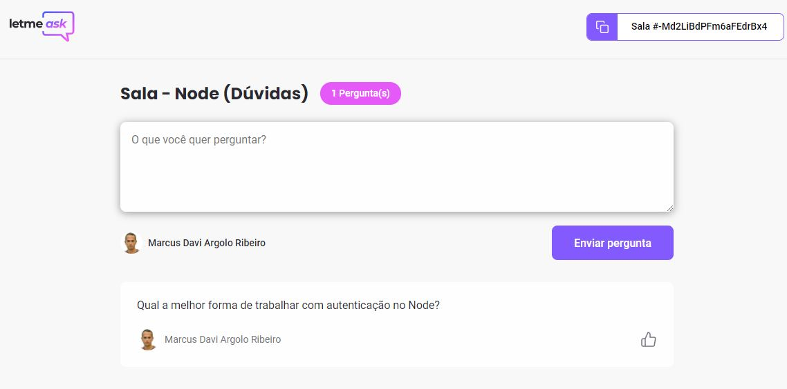

<p align="center">
  
 </p>

# Let Me Ask
Projeto Construído durante o evento Next Level Week Together (Missão Reactjs) da Rocketseat em Junho de 2021. Evento ministrado por Diego Fernandes. No aplicativo é possível que um usuário crie uma sala para registros das dúvidas de um determinado assunto.

## Como Rodar (usando yarn)
1. Clonar o repositório
2. Navegar até a pasta raiz do projeto e rodar o comando para baixar as dependências
```
yarn
```
3. Após baixar as dependências rodar o comando abaixo para subir a aplicação:
```
yarn start
``` 
4. Acessar a url http://localhost:3030/

## Aplicação em produção
https://letmeask-m.web.app/

# Prints da aplicação



